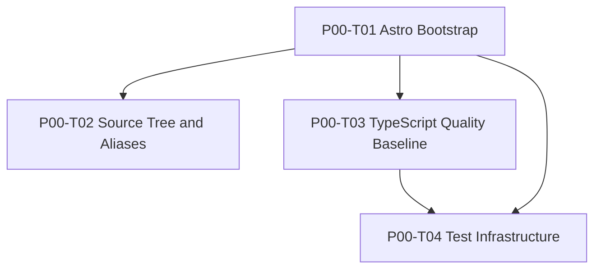

# P00 — Project Foundation

> **Phase ID:** `P00`  
> **Phase name:** Project Foundation  
> **Status:** Ready  
> **Version:** 1.1.0  
> **Date:** 2026-07-09  
> **Parent roadmap:** `IMPLEMENTATION-ROADMAP.md`  
> **Normative architecture:** `ARCHITECTURE.md`  
> **Blocking:** Yes  
> **Depends on:** None

---

## 1. Purpose

P00 establishes the minimum trustworthy project baseline for 4all.tools.

The phase creates a clean Astro repository that can receive the later architecture without introducing premature domain abstractions, speculative routing infrastructure, fake feature implementations, or duplicated locale applications.

P00 is deliberately infrastructure-only.

The phase MUST answer these questions before business-domain work begins:

1. Can the project install reproducibly?
2. Can the project start locally?
3. Can the project build as a static Astro site?
4. Is Tailwind CSS 4 integrated through the supported Vite-plugin path?
5. Is the English-unprefixed i18n direction declared at framework configuration level?
6. Are source-code architectural boundaries reserved and visible?
7. Does TypeScript operate under a strict baseline?
8. Can unit, integration, and build smoke tests run?
9. Is there a single verification command suitable for local use and CI?

The phase MUST NOT attempt to solve the later domain problems of:

- stable tool identity;
- taxonomy;
- localized entity slugs;
- Content Collections;
- route registry;
- route resolution;
- `getStaticPaths()` factories;
- page-model composition;
- real templates;
- real tools;
- canonical URLs;
- `hreflang`;
- runtime API execution.

The central P00 principle is:

> **Build a strict, reproducible shell for the architecture; do not pre-implement the architecture with placeholders.**

---

## 2. Architectural role

P00 is the foundation below every later phase:

```text
P00 Project Foundation
        ↓
P01 Core Domain & i18n
        ↓
P02 Hierarchical Taxonomy
        ↓
P03 Content System
        ↓
P04 Routing Core
        ↓
...
```

P00 MUST preserve the architectural dependency direction defined by `ARCHITECTURE.md`.

It does not yet populate all layers, but it reserves their boundaries:

```text
src/
├── pages/
├── templates/
├── layouts/
├── components/
├── features/
├── domain/
├── routing/
├── i18n/
├── services/
├── server/
└── styles/
```

P00 MUST establish `src/templates/` as the page-composition namespace.

P00 MUST NOT create `src/views/`.

---

## 3. Normative references

P00 implementations MUST remain consistent with the following architectural decisions already established for 4all.tools:

### 3.1 Rendering

```text
SSG-first
```

Astro configuration MUST explicitly use:

```js
output: 'static'
```

Even if static output is currently Astro's default, the project records the decision explicitly because it is architectural policy.

### 3.2 Site URL

```text
https://4all.tools
```

Astro configuration MUST declare:

```js
site: 'https://4all.tools'
```

### 3.3 Trailing slash policy

Canonical route style:

```text
/developer/json-validator/
/es/desarrollo/validador-json/
```

Astro configuration MUST declare:

```js
trailingSlash: 'always'
```

### 3.4 Initial locales

```text
en
es
pt
fr
```

### 3.5 Default locale

```text
en
```

English MUST remain unprefixed.

P00 therefore declares framework-level i18n intent equivalent to:

```js
i18n: {
  locales: ['en', 'es', 'pt', 'fr'],
  defaultLocale: 'en',
  routing: {
    prefixDefaultLocale: false,
  },
}
```

P00 MUST NOT configure locale fallback content.

P00 MUST NOT implement automatic browser-language redirects.

### 3.6 Tailwind CSS

The project uses Tailwind CSS 4.

P00 MUST use the Tailwind 4 Vite-plugin integration path.

P00 MUST NOT install or configure the legacy Astro Tailwind integration:

```text
@astrojs/tailwind
```

### 3.7 TypeScript

P00 MUST extend Astro's strict TypeScript configuration and add project-specific strictness where required by the architecture.

### 3.8 Test philosophy

Tests are incremental.

P00 establishes infrastructure only. It does not postpone future subsystem tests to P09.

---

## 4. Phase objective

At the end of P00, the repository MUST be a minimal but production-oriented Astro project with:

- reproducible dependency installation;
- current Astro 7.x baseline;
- Tailwind CSS 4 through `@tailwindcss/vite`;
- explicit static output;
- explicit site URL;
- explicit trailing slash policy;
- basic framework i18n declaration;
- English root home page;
- architectural source namespaces;
- strict TypeScript configuration;
- project scripts;
- Vitest-based unit and integration test capability;
- build smoke-test capability;
- a single local verification command.

---

## 5. Phase deliverables

P00 MUST deliver the following Task Specs:

```text
P00-T01  Astro Bootstrap
P00-T02  Source Tree and Aliases
P00-T03  TypeScript Quality Baseline
P00-T04  Test Infrastructure
```

Files:

```text
P00-foundation/
├── PHASE.md
├── T01-astro-bootstrap.md
├── T02-source-tree-and-aliases.md
├── T03-typescript-quality-baseline.md
└── T04-test-infrastructure.md
```

---

## 6. Task dependency graph



Equivalent sequence:

```text
T01 Astro Bootstrap
    ├──→ T02 Source Tree and Aliases
    └──→ T03 TypeScript Quality Baseline
             ↓
         T04 Test Infrastructure
```

T02 and T03 MAY be implemented in parallel after T01 is verified.

T04 MUST wait until the package scripts and TypeScript baseline are sufficiently stable.

---

## 7. Phase scope

### 7.1 In scope

P00 includes:

- Astro project initialization;
- package manager baseline;
- Node runtime baseline;
- dependency lockfile;
- Astro 7.x dependency policy;
- Tailwind CSS 4 setup;
- global stylesheet entrypoint;
- minimal English root page;
- Astro static output configuration;
- site configuration;
- trailing slash configuration;
- basic Astro i18n locale declaration;
- source boundary directories;
- canonical TypeScript root alias;
- strict TypeScript configuration;
- source naming rules;
- package scripts;
- Vitest infrastructure;
- test directory structure;
- build smoke test;
- local verification workflow.

### 7.2 Out of scope

P00 explicitly excludes:

- `Locale` domain type;
- `SUPPORTED_LOCALES` domain constant;
- localized message dictionaries;
- locale guards;
- stable entity ID contracts;
- publication contracts;
- taxonomy nodes;
- taxonomy tree engine;
- Content Collections;
- `content.config.ts` domain schemas;
- route contracts;
- route registry;
- localized URL builder;
- route resolver;
- `getStaticPaths()` factories;
- `[category]/[...path].astro` implementation;
- localized route adapters under `src/pages/es`, `pt`, `fr`;
- final layouts;
- final templates;
- design system;
- production navigation;
- tool registry;
- component registry;
- `json-validator`;
- sitemap integration;
- redirects;
- API adapters;
- SSR;
- on-demand rendering.

---

## 8. Baseline repository policy

### 8.1 Package manager

P00 uses `npm` as the documented baseline package manager.

Requirements:

- `package-lock.json` MUST be committed.
- Dependency installation in verification environments SHOULD use:

```bash
npm ci
```

- The repository MUST NOT commit multiple package-manager lockfiles.

Prohibited combinations include:

```text
package-lock.json + pnpm-lock.yaml
package-lock.json + yarn.lock
```

A future package-manager migration requires an explicit repository-level decision, not ad hoc developer preference.

### 8.2 Node runtime

The baseline runtime MUST be Node.js 22 or a later explicitly approved runtime compatible with the selected Astro 7.x version.

P00 SHOULD create:

```text
.nvmrc
```

with:

```text
22
```

`package.json` SHOULD declare an engine floor compatible with the implementation baseline.

The exact patch version is pinned by developer/CI environment policy, not by hardcoding an obsolete patch in this phase spec.

### 8.3 Dependency version policy

P00 MUST:

- use Astro 7.x;
- use Tailwind CSS 4.x;
- commit the lockfile;
- avoid `latest` ranges in committed `package.json`;
- allow the lockfile to pin exact transitive resolutions.

The implementation SHOULD select the current stable compatible minor/patch available when P00 is executed.

---

## 9. Expected repository state after P00

The exact generated support files MAY vary slightly with the current Astro CLI, but the repository MUST converge to this logical state:

```text
4all-tools/
├── public/
│   └── favicon.svg
│
├── src/
│   ├── pages/
│   │   └── index.astro
│   │
│   ├── templates/
│   ├── layouts/
│   ├── components/
│   ├── features/
│   ├── domain/
│   ├── routing/
│   ├── i18n/
│   ├── services/
│   ├── server/
│   └── styles/
│       └── global.css
│
├── tests/
│   ├── unit/
│   ├── integration/
│   └── build/
│
├── .gitignore
├── .nvmrc
├── astro.config.mjs
├── package.json
├── package-lock.json
├── tsconfig.json
├── vitest.config.ts
└── README.md
```

### 9.1 Empty directory tracking

Git does not track empty directories.

P00 MAY use temporary `.gitkeep` files only where a boundary must be visible in the repository before real code exists.

Rules:

- `.gitkeep` MUST contain no implementation logic.
- `.gitkeep` SHOULD be removed when the first real file enters the directory.
- P00 MUST NOT create speculative placeholder `.ts` modules solely to keep directories tracked.

---

## 10. Minimal page policy

P00 MUST include one minimal English root page:

```text
src/pages/index.astro
```

Its purpose is only to prove:

- file-based routing;
- global CSS import;
- Tailwind processing;
- static build output.

It MUST NOT become the final homepage.

It MUST NOT include:

- production navigation;
- tool search;
- fake category cards;
- hardcoded multilingual routing;
- fake tool data;
- future template composition.

A compliant minimal page MAY render:

```text
4all.tools
Foundation ready
```

with one Tailwind utility class as a processing smoke check.

---

## 11. Astro configuration policy

P00 MUST produce an `astro.config.mjs` equivalent in behavior to:

```js
import { defineConfig } from 'astro/config';
import tailwindcss from '@tailwindcss/vite';

export default defineConfig({
  site: 'https://4all.tools',

  output: 'static',

  trailingSlash: 'always',

  i18n: {
    locales: ['en', 'es', 'pt', 'fr'],
    defaultLocale: 'en',
    routing: {
      prefixDefaultLocale: false,
    },
  },

  vite: {
    plugins: [tailwindcss()],
  },
});
```

### 11.1 Important P00 limitation

This is framework bootstrap configuration only.

P00 MUST NOT treat this array as the final application-domain locale source of truth.

P01 will introduce typed locale contracts.

Until P01, duplication between Astro configuration and future domain locale contracts does not exist because the latter have not yet been implemented.

### 11.2 No fallback

P00 MUST NOT configure:

```js
fallback: {
  es: 'en',
}
```

or equivalent behavior.

### 11.3 No automatic language redirect

P00 MUST NOT implement middleware that redirects users based on `Accept-Language`.

### 11.4 `redirectToDefaultLocale`

P00 SHOULD omit `redirectToDefaultLocale` because English is unprefixed and `prefixDefaultLocale` is false.

The architecture intent is clearer when irrelevant options are not cargo-culted into configuration.

---

## 12. Tailwind CSS policy

P00 MUST install and configure Tailwind CSS 4 using the Vite plugin path.

Expected dependencies include:

```text
tailwindcss
@tailwindcss/vite
```

P00 MUST NOT use:

```text
@astrojs/tailwind
```

The global stylesheet MUST include:

```css
@import "tailwindcss";
```

P00 MUST NOT create a speculative `tailwind.config.*` unless an actual Tailwind 4 requirement needs it.

P00 MUST NOT introduce a design system or theme tokens that have not yet been specified.

---

## 13. TypeScript policy

P00 MUST extend:

```text
astro/tsconfigs/strict
```

The project SHOULD enable:

```json
{
  "noUncheckedIndexedAccess": true,
  "exactOptionalPropertyTypes": true
}
```

The canonical source alias MUST be:

```text
@/* → src/*
```

Therefore imports such as these MUST resolve:

```ts
import type { Something } from '@/domain/example';
import Component from '@/components/Component.astro';
```

P00 SHOULD NOT add redundant aliases for every top-level directory unless a concrete need emerges.

The root alias already preserves architectural readability while minimizing configuration surface.

---

## 14. Quality command policy

P00 MUST establish these conceptual commands:

```text
dev
build
preview
check
test
test:unit
test:integration
test:build
verify
```

Recommended behavior:

```text
npm run dev
    Start Astro development server.

npm run build
    Produce static build.

npm run preview
    Preview production build.

npm run check
    Run Astro/TypeScript static checks.

npm run test:unit
    Run unit test suite.

npm run test:integration
    Run integration test suite.

npm run test
    Run unit + integration tests.

npm run test:build
    Build and run build smoke assertions.

npm run verify
    Run check + tests + build smoke test.
```

P00 MAY add formatting commands if the chosen implementation includes Prettier.

P00 MUST NOT overload `build` with future architecture validation that does not exist yet.

P09 will own the global architecture-validation orchestration.

---

## 15. Test policy

P00 establishes three test classes:

### 15.1 Unit

```text
tests/unit/
```

Purpose:

- pure functions;
- future taxonomy algorithms;
- future route builders;
- tool engines.

P00 only needs a trivial infrastructure proof.

### 15.2 Integration

```text
tests/integration/
```

Purpose:

- interactions among project modules;
- future registries and services;
- framework-adjacent integration where appropriate.

P00 only needs a trivial infrastructure proof.

### 15.3 Build

```text
tests/build/
```

Purpose:

- validate generated static output;
- prove important routes exist;
- inspect build artifacts.

P00 MUST include a build smoke assertion verifying at least:

```text
dist/index.html exists
```

and SHOULD verify that the built root page contains the known bootstrap marker.

---

## 16. Phase acceptance criteria

P00 passes only when all criteria below are true.

### 16.1 Installation

- [ ] `npm ci` succeeds from a clean checkout.
- [ ] Exactly one supported lockfile is committed.
- [ ] No undeclared local/global tool is required for verification.

### 16.2 Development

- [ ] `npm run dev` starts the Astro project.
- [ ] `/` renders the minimal bootstrap page.
- [ ] Tailwind utilities are processed.

### 16.3 Build

- [ ] `npm run build` succeeds.
- [ ] Output is static.
- [ ] `dist/index.html` exists.
- [ ] trailing-slash policy is configured.
- [ ] site URL is configured.

### 16.4 i18n bootstrap

- [ ] Astro declares `en`, `es`, `pt`, `fr`.
- [ ] `en` is the default locale.
- [ ] `prefixDefaultLocale` is false.
- [ ] no locale fallback is configured.
- [ ] no browser-language redirect middleware exists.

### 16.5 Architecture boundaries

- [ ] `src/templates/` exists or is reserved as a tracked boundary.
- [ ] `src/views/` does not exist.
- [ ] other top-level architecture boundaries are reserved.
- [ ] no speculative domain implementations are added.

### 16.6 TypeScript

- [ ] project extends Astro strict configuration.
- [ ] `@/*` resolves to `src/*`.
- [ ] `noUncheckedIndexedAccess` is enabled unless an explicit phase exception is documented.
- [ ] `exactOptionalPropertyTypes` is enabled unless an explicit phase exception is documented.
- [ ] `npm run check` succeeds.

### 16.7 Tests

- [ ] unit test command succeeds.
- [ ] integration test command succeeds.
- [ ] build smoke test succeeds.
- [ ] `npm run verify` succeeds.

---

## 17. Phase Gate P00

P00 MUST enter `Gate Review` after all four Task Specs are implemented.

The Phase Gate requires a clean-room verification sequence.

Recommended sequence:

```bash
rm -rf node_modules dist .astro
npm ci
npm run verify
```

On Windows or cross-platform CI, equivalent clean commands MAY be used.

The gate passes only if:

1. dependencies install from lockfile;
2. static checks pass;
3. unit tests pass;
4. integration tests pass;
5. production build succeeds;
6. build smoke tests pass;
7. source boundaries match the spec;
8. no P01+ domain implementation has leaked into P00.

---

## 18. Exit artifacts

P00 MUST leave the repository with:

```text
astro.config.mjs
package.json
package-lock.json
tsconfig.json
vitest.config.ts
.nvmrc
src/pages/index.astro
src/styles/global.css
tests/unit/*
tests/integration/*
tests/build/*
```

plus the architecture boundary directories defined by P00-T02.

---

## 19. Phase risks

### Risk 1 — Generated starter pollution

Astro starter templates may include demo components, assets, or styles.

Mitigation:

- use the minimal/empty starter;
- remove demo content;
- keep only explicit P00 artifacts.

### Risk 2 — Tailwind 3 legacy setup

A developer may install `@astrojs/tailwind` from outdated tutorials.

Mitigation:

- P00-T01 explicitly requires Tailwind 4 Vite plugin;
- dependency review checks for prohibited package.

### Risk 3 — Premature i18n abstraction

A developer may implement `Locale`, dictionaries, or route helpers in P00.

Mitigation:

- P01 owns domain i18n contracts;
- P00 only declares framework-level locale intent.

### Risk 4 — Placeholder architecture modules

A developer may create fake `registry.ts`, `types.ts`, or `index.ts` files merely to populate directories.

Mitigation:

- use `.gitkeep` if tracking is necessary;
- no speculative modules.

### Risk 5 — Excessive tooling

P00 may become a toolchain project rather than a product foundation.

Mitigation:

- prefer `astro check`, strict TypeScript, Vitest, and minimal formatting support;
- defer nonessential tooling until a real need appears.

### Risk 6 — Tests coupled to development server ports

Build smoke tests may become flaky if they start servers unnecessarily.

Mitigation:

- P00 build tests inspect generated files directly;
- browser E2E is deferred.

---

## 20. Rollback and recovery

P00 changes are foundational but still early.

If a task fails:

- revert only the failing Task Spec change set where possible;
- do not patch around dependency or config conflicts with undocumented exceptions;
- update the Task Spec if the current framework behavior invalidates an assumption;
- preserve the architecture invariants.

A failed Tailwind integration MUST NOT be “fixed” by falling back to Tailwind 3.

A failed locale configuration MUST NOT be “fixed” by prefixing English with `/en/`.

A failed source tree setup MUST NOT introduce `src/views/`.

---

## 21. Definition of Ready for P00

P00 is Ready because:

- [x] architecture direction is established;
- [x] roadmap decomposition is established;
- [x] P00 has no upstream implementation dependency;
- [x] stack baseline is known;
- [x] locales are known;
- [x] URL prefix strategy is known;
- [x] rendering strategy is known;
- [x] Task Specs are defined.

---

## 22. Definition of Done for P00

P00 is Complete only when:

- [ ] P00-T01 is Verified.
- [ ] P00-T02 is Verified.
- [ ] P00-T03 is Verified.
- [ ] P00-T04 is Verified.
- [ ] clean installation succeeds.
- [ ] `npm run verify` succeeds.
- [ ] production static build succeeds.
- [ ] build smoke assertions pass.
- [ ] architecture boundary review passes.
- [ ] `src/views/` is absent.
- [ ] no P01+ domain logic has been prematurely introduced.
- [ ] Phase Gate P00 has been reviewed explicitly.

---

## 23. Next phase handoff

P00 hands a stable project shell to:

```text
P01 — Core Domain & i18n
```

P01 may assume:

- strict TypeScript is available;
- source aliases work;
- test infrastructure works;
- Astro i18n intent is declared;
- architecture namespaces exist;
- verification scripts exist.

P01 MUST NOT assume:

- typed locale contracts already exist;
- global dictionaries already exist;
- stable entity IDs already exist;
- publication contracts already exist.

Those are P01 deliverables.

---

## 24. Primary implementation references

Implementation SHOULD verify current official documentation at execution time, especially for CLI-generated files and compatible dependency versions.

Relevant official references:

- Astro project bootstrap: `https://astro.build/`
- Astro configuration: `https://docs.astro.build/en/reference/configuration-reference/`
- Astro project structure: `https://docs.astro.build/en/basics/project-structure/`
- Astro i18n routing: `https://docs.astro.build/en/guides/internationalization/`
- Astro styling and Tailwind 4: `https://docs.astro.build/en/guides/styling/`
- Tailwind Astro installation guide: `https://tailwindcss.com/docs/installation/framework-guides/astro`

---

# End of P00 Phase Specification
