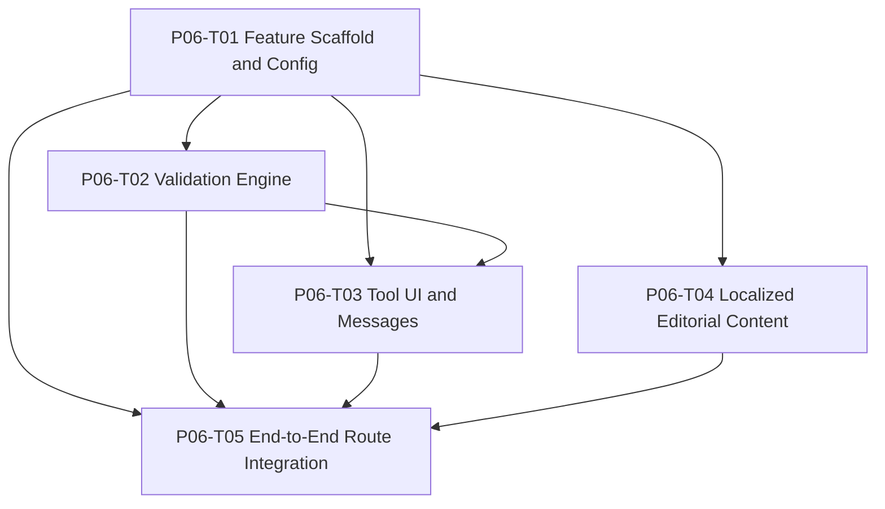

# P06 — JSON Validator Vertical Slice

> **Phase ID:** `P06`  
> **Phase name:** JSON Validator Vertical Slice  
> **Status:** Ready  
> **Version:** 1.1.0  
> **Date:** 2026-07-10  
> **Parent roadmap:** `IMPLEMENTATION-ROADMAP.md`  
> **Normative architecture:** `ARCHITECTURE.md`  
> **Blocking:** Yes — architectural proof milestone  
> **Depends on:** `P00` through `P05`

---

## Revision 1.1 — Integration ownership correction

P06 production registries and adapters MUST follow the corrected ownership model:

```text
src/domain/tools/types.ts
    pure contracts only

src/features/tools/registry.ts
src/features/tools/component-registry.ts
src/features/tools/message-registry.ts
    feature aggregation and UI/message wiring

src/routing/providers/tool-route-provider.ts
    adapter from feature definitions to P04 route DTOs

src/templates/page-models/providers/tool-presentation-provider.ts
    adapter for P05 page-model composition
```

This section supersedes any later source-tree example that places registries or adapters under `src/domain/tools/`.

---

## 1. Purpose

P06 implements the first complete production tool in 4all.tools and proves that the architecture created in P00–P05 works as one coherent system.

The phase delivers a real, localized, client-side JSON Validator at:

```text
/developer/json-validator/
/es/desarrollo/validador-json/
/pt/desenvolvedor/validador-json/
/fr/developpement/validateur-json/
```

All four routes MUST represent the same stable entity:

```text
toolId = json-validator
```

P06 is not another horizontal infrastructure phase. It is the first mandatory vertical slice:

```text
stable identity
    +
hierarchical taxonomy
    +
localized editorial content
    +
localized route metadata
    +
route registry
    +
getStaticPaths()
    +
page-model composition
    +
template rendering
    +
real feature component
    +
client-side engine
    ↓
working production tool pages
```

The central phase principle is:

> **Prove every architectural boundary with one real tool before scaling the catalog.**

---

## 2. Architectural role

P06 is the proof point between the platform foundation and product scale:

```text
P00 Foundation
    ↓
P01 Core Domain & i18n
    ↓
P02 Hierarchical Taxonomy
    ↓
P03 Content System
    ↓
P04 Routing Core
    ↓
P05 Astro Delivery Layer
    ↓
P06 JSON Validator Vertical Slice
    ↓
P07 SEO & Locale Navigation
    ↓
P08 Blog Platform
    ↓
P09 Build Validation & Hardening
```

P06 consumes:

```text
P01
├── ToolId
├── Locale
├── Localized<T>
├── PublicationStatus
└── global message boundaries

P02
├── toolTaxonomy
├── developer root
├── data-formats node
└── json primary category

P03
├── tools Content Collection
├── content schemas
├── typed query services
└── render(entry) boundary

P04
├── ToolRouteDefinition contract
├── route provider contract
├── path builders
├── route registry
├── route resolver
└── static path factories

P05
├── ToolPageModel foundation
├── ToolTemplate
├── ToolLayout
├── tool page composer boundary
└── English/localized route adapters
```

P06 produces the first production implementations of:

```text
ToolDefinition
Tool registry
Tool component registry
Tool route provider
Tool presentation provider
Feature-local message registry
JSON validator engine
JSON validator UI
Localized tool content
Real route integration
```

---

## 3. Why P06 is mandatory

Without P06, P00–P05 could remain internally consistent but practically incomplete.

Infrastructure-only success can hide defects such as:

```text
route definitions cannot feed the registry cleanly
page models cannot load real features
feature component typing is impractical
localized content cannot be correlated reliably
client scripts do not initialize correctly
ToolTemplate owns the wrong responsibility
route adapters still depend on fixture behavior
```

P06 converts those risks into verifiable outcomes.

The project MUST NOT begin broad catalog production until P06 passes its Phase Gate.

---

## 4. Required final routes

The phase MUST generate these canonical route shapes, although final canonical and hreflang tags belong to P07:

| Locale | Public route | Stable target |
|---|---|---|
| `en` | `/developer/json-validator/` | `tool:json-validator` |
| `es` | `/es/desarrollo/validador-json/` | `tool:json-validator` |
| `pt` | `/pt/desenvolvedor/validador-json/` | `tool:json-validator` |
| `fr` | `/fr/developpement/validateur-json/` | `tool:json-validator` |

All routes MUST use the `flat` route strategy even though the taxonomy is deeper:

```text
Developer
└── Data Formats
    └── JSON
        └── JSON Validator
```

The public English route therefore remains:

```text
/developer/json-validator/
```

not:

```text
/developer/data-formats/json/json-validator/
```

---

## 5. Phase scope

### 5.1 In scope

- first production `ToolDefinition` contract if not already finalized;
- first production tool registry;
- first production tool component registry;
- `json-validator` feature directory;
- pure TypeScript JSON engine;
- validate, format, and minify operations;
- accessible interactive UI;
- feature-local translations for `en`, `es`, `pt`, `fr`;
- localized editorial content for all four locales;
- production route provider integration;
- publication availability integration;
- P05 page composer and template integration;
- static route generation;
- unit, integration, build, and focused browser-level tests;
- privacy and client-only execution guarantees.

### 5.2 Out of scope

- server endpoints;
- backend API calls;
- external APIs;
- JSON Schema validation;
- duplicate-key detection;
- comments in JSON;
- JSON5;
- YAML conversion;
- file upload unless explicitly approved as a small follow-up;
- very large file streaming;
- syntax highlighting editor frameworks;
- final canonical/hreflang implementation;
- language switcher;
- breadcrumbs finalization;
- sitemap generation;
- broad tool catalog generation;
- generalized form framework;
- React, Preact, Vue, Svelte, or Solid integration solely for this tool.

---

## 6. Core P06 decisions

### 6.1 Stable identity

The immutable identity is:

```text
json-validator
```

It MUST remain the join key across:

```text
tool definition
component registry
route target
content entries
feature messages
page model
analytics metadata later
related tools later
```

It MUST NOT be replaced by:

```text
developer/json-validator
/developer/json-validator/
validador-json
validateur-json
src/features/tools/developer/json-validator
```

---

### 6.2 Physical feature path

The feature MUST live at:

```text
src/features/tools/developer/json-validator/
```

This mirrors the initial English root namespace and English tool slug for source organization.

The filesystem path is organizational and MUST NOT become the stable identity.

---

### 6.3 Execution strategy

The tool MUST declare:

```text
execution.type = client
```

All validation, formatting, and minification MUST occur in the browser.

The implementation MUST NOT:

- send JSON input to a server;
- call an Astro endpoint;
- call a third-party API;
- persist input remotely;
- introduce a server adapter for this feature.

---

### 6.4 Client technology

The default implementation MUST use:

```text
Astro component
+
processed client-side <script>
+
pure TypeScript engine
```

A UI framework MUST NOT be added solely for this tool.

A framework MAY be reconsidered later only if multiple tools demonstrate shared state and interaction complexity that justify the dependency through an explicit architectural decision.

---

### 6.5 Engine independence

The engine MUST NOT depend on:

```text
window
document
HTMLElement
Astro
DOM events
localized messages
CSS classes
```

It MUST be importable and testable as plain TypeScript.

---

### 6.6 Tool-local messages

Tool UI strings MUST live under:

```text
src/features/tools/developer/json-validator/messages/
```

They MUST NOT be added to P01 global dictionaries.

---

### 6.7 Editorial content separation

Long-form localized content MUST live in P03 Content Collections.

It MUST NOT be embedded in:

```text
Tool.astro
engine/*.ts
messages/*.ts
tool.config.ts
```

---

### 6.8 Route integration

P06 MUST connect a real tool route provider to P04.

It MUST NOT add one physical page file per locale or per tool.

The existing catch-all route architecture remains authoritative.

---

### 6.9 No final SEO overreach

P06 MAY render localized title and description from P03.

P06 MUST NOT implement the final:

```text
canonical cluster
hreflang cluster
language switcher
x-default policy
```

Those belong to P07.

---

## 7. Task package

```text
P06-json-validator-vertical-slice/
├── PHASE.md
├── T01-feature-scaffold-and-config.md
├── T02-validation-engine.md
├── T03-tool-ui-and-messages.md
├── T04-localized-editorial-content.md
└── T05-end-to-end-route-integration.md
```

---

## 8. Task overview

| Task | Name | Primary output |
|---|---|---|
| P06-T01 | Feature Scaffold and Config | Real tool definition, registries, feature namespace |
| P06-T02 | Validation Engine | Pure TypeScript validate/format/minify engine |
| P06-T03 | Tool UI and Messages | Accessible localized interactive tool component |
| P06-T04 | Localized Editorial Content | Four published localized content entries |
| P06-T05 | End-to-End Route Integration | Four working routes through the complete architecture |

---

## 9. Internal dependency graph



Recommended sequence:

```text
T01
├──→ T02
└──→ T04

T02
↓
T03

T01 + T02 + T03 + T04
↓
T05
```

---

## 10. Expected production source tree

```text
src/
├── domain/
│   └── tools/
│       └── types.ts
│
├── features/
│   └── tools/
│       ├── registry.ts
│       ├── component-registry.ts
│       ├── message-registry.ts
│       └── developer/
│           └── json-validator/
│               ├── tool.config.ts
│               ├── Tool.astro
│               ├── types.ts
│               ├── engine/
│               │   ├── validate.ts
│               │   ├── format.ts
│               │   ├── minify.ts
│               │   └── error-details.ts
│               ├── components/
│               │   ├── JsonEditor.astro
│               │   ├── ToolActions.astro
│               │   └── ValidationResult.astro
│               ├── messages/
│               │   ├── types.ts
│               │   ├── en.ts
│               │   ├── es.ts
│               │   ├── pt.ts
│               │   ├── fr.ts
│               │   └── registry.ts
│               └── tests/
│                   ├── validate.test.ts
│                   ├── format.test.ts
│                   ├── minify.test.ts
│                   └── fixtures.ts
│
├── routing/
│   └── providers/
│       └── tool-route-provider.ts
│
└── templates/
    └── page-models/
        └── providers/
            └── tool-presentation-provider.ts
```

The exact subdivision under `components/` MAY be simplified if `Tool.astro` remains readable and testable.

Do not create directories merely to satisfy the tree when they contain no meaningful separation.

---

## 11. Required tool behavior

The first release MUST support:

### Validate

- accepts any valid JSON value;
- reports valid or invalid state;
- treats whitespace-only input as empty input;
- does not mutate input when validating;
- handles parser failures without crashing.

### Format

- validates before formatting;
- outputs canonical pretty-printed JSON using two-space indentation;
- preserves parsed JSON semantics;
- updates the editor only on success;
- does not destroy invalid input.

### Minify

- validates before minifying;
- outputs compact JSON;
- updates the editor only on success;
- does not destroy invalid input.

### Copy

- copies the current editor content when clipboard capability is available;
- reports success or failure accessibly;
- has a documented fallback when clipboard write fails.

### Clear

- clears editor and result state;
- does not require page reload;
- returns focus according to the final accessible interaction policy.

---

## 12. JSON semantic scope

The engine uses standard JavaScript JSON semantics.

Valid top-level examples include:

```json
{"name":"4all.tools"}
```

```json
[1, 2, 3]
```

```json
"hello"
```

```json
42
```

```json
true
```

```json
null
```

The engine MUST NOT incorrectly restrict valid JSON to objects and arrays only.

Known JavaScript JSON semantics that are not “fixed” by P06 include:

- large integers may lose precision when parsed as JavaScript numbers;
- duplicate object keys are accepted by `JSON.parse()` and later keys win;
- comments are invalid;
- trailing commas are invalid;
- `NaN`, `Infinity`, and `undefined` are invalid;
- JSON5 is not supported.

These limitations SHOULD be documented in editorial content or help text where useful.

---

## 13. Privacy requirement

The tool MUST be described and implemented as browser-local.

Required invariant:

```text
user input
    ↓
browser engine
    ↓
result
```

Forbidden flow:

```text
user input
    ↓
network request
```

Tests SHOULD verify that core tool actions do not initiate `fetch`, XHR, or form submission.

---

## 14. Accessibility requirements

At minimum:

- the JSON input has a visible label;
- all buttons have explicit text or accessible names;
- status is available through an appropriate live region;
- validity is not communicated by color alone;
- keyboard interaction supports all actions;
- focus is not moved unexpectedly on each keystroke;
- errors remain readable at zoom and narrow widths;
- disabled states are semantically disabled;
- decorative icons are hidden from assistive technology;
- status announcements are concise and not excessively repeated.

---

## 15. Performance requirements

P06 does not require streaming or worker-based parsing.

However:

- no UI framework runtime should be added solely for this feature;
- no parser library should be added when standard JSON semantics are sufficient;
- validation MUST run on explicit action, not every keystroke by default;
- the script MUST initialize idempotently;
- the engine MUST avoid repeated parse operations within one action when one parse result can be reused.

Very large document support is out of scope and MAY become a future enhancement using Web Workers after measured need.

---

## 16. Security requirements

- do not use `eval()` or `Function()`;
- do not render user JSON through `set:html`;
- write user-derived output through form values or `textContent` semantics;
- do not interpolate raw parser messages into HTML unsafely;
- do not expose input in URLs;
- do not persist input in local storage without a later explicit product decision;
- do not log JSON input in production analytics or console instrumentation.

---

## 17. Testing strategy

### Unit tests

Owned mainly by P06-T02:

```text
valid JSON values
invalid syntax
empty input
format output
minify output
non-destructive failure
error contract
```

### Component/integration tests

Owned mainly by P06-T03:

```text
localized labels
button behavior
live-region behavior
copy behavior abstraction
clear behavior
no network action
```

### Route/build tests

Owned by P06-T05:

```text
four localized pages generated
same stable target
localized content rendered
real feature rendered
flat route strategy
no /en/ route
no duplicate physical route files
```

### Browser-level smoke tests

Recommended:

```text
paste valid JSON
validate
format
minify
paste invalid JSON
observe accessible failure
switch actions without reload
```

---

## 18. Phase Gate

P06 is complete only when all gates pass.

### G01 — Real production identity

- [ ] `json-validator` exists as a real registered `ToolId`.
- [ ] The physical feature path is correct.
- [ ] URL and filesystem path are not used as identity.

### G02 — Pure engine

- [ ] Engine has no DOM or Astro dependency.
- [ ] Validate, format, and minify unit tests pass.
- [ ] Error contracts are stable and do not depend on exact engine message wording.

### G03 — Accessible client UI

- [ ] Tool works without a UI framework dependency.
- [ ] Tool-specific messages exist for all four locales.
- [ ] Actions are keyboard accessible.
- [ ] Result state is exposed accessibly.
- [ ] No user input is sent over the network.

### G04 — Localized editorial content

- [ ] One published content entry exists per initial locale.
- [ ] All entries use `toolId: json-validator`.
- [ ] No content file claims public route ownership.
- [ ] Content schemas pass.

### G05 — Real route integration

- [ ] P04 registry consumes the production tool route provider.
- [ ] P05 page composer consumes the production tool provider.
- [ ] P05 ToolTemplate resolves the production component by stable ID.
- [ ] No page file imports `JsonValidatorTool` directly.

### G06 — Four working pages

- [ ] `/developer/json-validator/`
- [ ] `/es/desarrollo/validador-json/`
- [ ] `/pt/desenvolvedor/validador-json/`
- [ ] `/fr/developpement/validateur-json/`

All four MUST:

- [ ] build statically;
- [ ] resolve to `tool:json-validator`;
- [ ] render localized content;
- [ ] render localized feature messages;
- [ ] execute the same engine;
- [ ] use flat routes.

### G07 — No architecture bypass

- [ ] No new per-tool route files.
- [ ] No raw content queries in page adapters.
- [ ] No route strings hardcoded in the feature.
- [ ] No locale fallback to English.
- [ ] No server endpoint.
- [ ] No final P07 SEO logic pulled forward.

### G08 — Verification

- [ ] TypeScript/Astro checks pass.
- [ ] Unit tests pass.
- [ ] Integration tests pass.
- [ ] Production build passes.
- [ ] Build output contains the four expected pages.
- [ ] Focused browser smoke tests pass.

---

## 19. Stop-the-line conditions

Implementation MUST pause if:

- the tool cannot be registered without using its URL as identity;
- P04 requires hardcoding `json-validator` in generic route code;
- P05 requires a direct feature import in each route adapter;
- the component registry cannot resolve by stable ID;
- the Spanish route requires English content fallback;
- a tool action sends JSON over the network;
- engine tests require DOM setup;
- exact `JSON.parse()` error wording becomes part of the stable contract;
- tool UI requires a framework solely because the component boundary is poorly designed;
- the four routes produce different stable identities.

The response MUST be to correct the contract, not add a local bypass.

---

## 20. Task statuses

At package creation:

```text
P06-T01 Ready
P06-T02 Ready after T01 contract approval
P06-T03 Ready after T01 and T02 contract approval
P06-T04 Ready after T01 identity/config approval
P06-T05 Blocked until T01–T04 are implemented
```

---

## 21. Definition of Done for P06

P06 is `Complete` only when:

1. all five Task Specs are `Verified`;
2. all Phase Gate items pass;
3. the four localized routes exist in production build output;
4. tool functionality works in a real browser;
5. no route, content, or feature boundary is bypassed;
6. architecture documentation is updated if implementation exposed a necessary contract change;
7. the platform can add a second client-only tool by repeating the registered feature pattern rather than inventing a new one.

---

## 22. Expected architectural proof

At completion, the project must be able to trace one request as follows:

```text
/es/desarrollo/validador-json/
    ↓
P04 RouteRecord
    ↓
RouteTarget {
  kind: 'tool',
  toolId: 'json-validator'
}
    ↓
P05 composeToolPageModel(
  'es',
  'json-validator'
)
    ↓
P03 Spanish content entry
    ↓
P06 tool definition + component registry
    ↓
ToolTemplate
    ↓
JsonValidator Tool.astro
    ↓
Spanish feature messages
    ↓
pure browser JSON engine
```

If this trace is not explicit and testable, P06 is not complete.

---

## 23. Primary technical references

The implementation SHOULD verify behavior against the current official Astro documentation at implementation time:

- Client-side scripts: https://docs.astro.build/en/guides/client-side-scripts/
- Astro components: https://docs.astro.build/en/basics/astro-components/
- Islands architecture: https://docs.astro.build/en/concepts/islands/
- Content Collections: https://docs.astro.build/en/guides/content-collections/
- Routing: https://docs.astro.build/en/guides/routing/

---

# End of P06 Phase Specification
